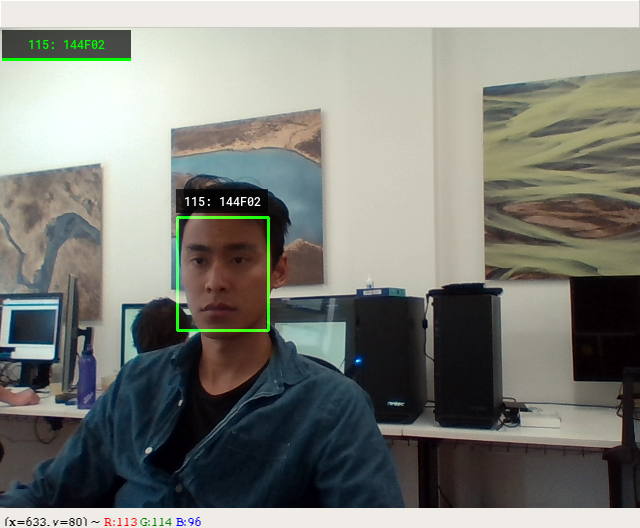
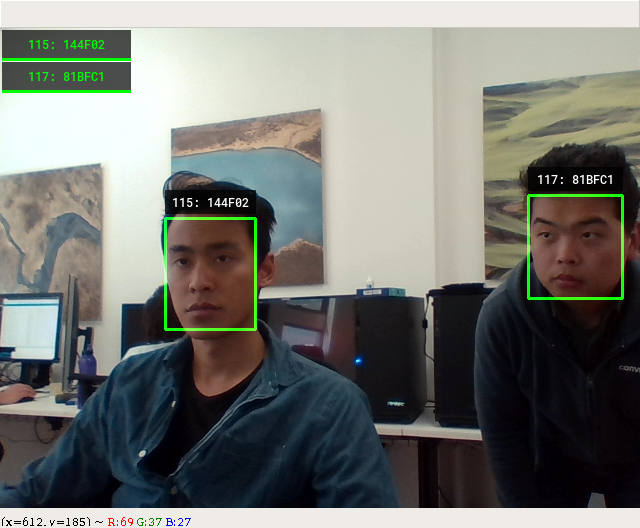
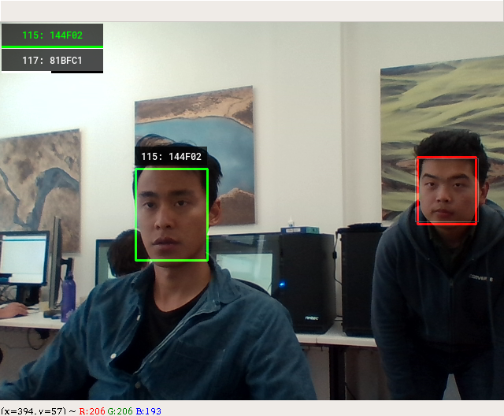

# Jetson Counter App

This counter app is a Python app designed to run on the Jetson (or any Ubuntu based OS). When on, it will read the video stream from a USB camera and detect faces in real time. If a face is detected, and it is close enough to the camera, a session will begin for that face. When that face is no longer detected, the session will end, and a log of the session will be written to disk as a json file.

## Quick Start

If running from a development environment (e.g. Intel based Ubuntu), it should be easy to test this app. First, use a Python environment of 3.5 or greater. Then install the requirements in the root directory of this project.

```bash
pip install -r requirements.txt
```

Then to run the app with visualization, simply use the command:

```bash
python cmd_run_counter.py -v
```

The app will automatically download the Tensorflow model required for face detection, and should run whilst showing the results in a window.

## How It Works

* In real time (every frame) the counter app detects all faces from the camera.
* Each face is matched against a (short) history of observed faces. It will create a new *session* for each unique face.
* When a unique face disappears from view for a certain number of seconds, that session ends and is written to a JSON file.

Intuitively, each *individual* face will trigger a new session. Sessions will run concurrently (and so they can overlap). Whether a face belongs to a certain session or should spin up a new one depends on the *embedding distance* produced for each face.

## Visualization

If visualization is enabled, the app will open a live video feed to show what it is seeing. Here is what it looks like if there is a face detefcted, and a session is created. Each *active session* is listed in the top left corner in green. It should correspond with a bounding box in the video.



If a second face is detected, it will create a new session based on that face as well. These two sessions will run (start and end) independently of each other. There is no technical limit on the number of sessions that can be active simultaneously, but the physical and temporal constraints of  people being in front of the camera will probably serve as our limiting mechanism.



When a tagged face is no detected by the camera, it is either:

* Too far from the camera (will be highlighted in red).
* Too close to the edge (will be highlighted in red).
* Not detected in the image at all.

This will cause the face's matching session to decay. The decay is represented by a white line under the session tag, slowly receding. Once a session as decayed completely, we will assume that person has left. The session will then be serialized into a JSON file, and will be cleared from the app. 

* If that person comes back AFTER their session has ended, it will create a completely new session.
* If that person disappears and comes back BEFORE the session's countdown timer expires, the session will not end, and will be restored to full duration.




## Output

After each session ends, the app will generate a data file (json format) with that session's information. It will be saved to the output folder, with an increasing session index. The session index is actually persisted on the disk in a file called `session_id.txt`. It is meant to always be incrementing.

Here is a sample of what the session data file will look like.

```json
{
  "readable_time_end": "15:12",
  "readable_time_start": "15:11",
  "timestamp_start": 1541142684,
  "session_id": 113,
  "face_id": "bc8a28b9aed645d6ba86ee25fc594b9c",
  "date": "02/11/2018",
  "timestamp_end": 1541142720,
  "duration_in_seconds": 35.68
}
```

It contains keys and values about when the session was started (UNIX timestamp), the duration, the maximum number of faces that was seen simultaneously during the session, the date, and the session id.

***No faces, images, or personal information will be persisted or used in any way, shape, or form.***

## Settings

The settings for the app can be configured in the `settings.yaml` file.

| Setting Name              | Description                                                  | Default Value |
| ------------------------- | ------------------------------------------------------------ | ------------- |
| MIN_FACE_SIZE             | This is the minimum size (in pixels) for a detected face to be considered as a valid detection for a session. | 80            |
| MAX_VECTOR_LENGTH         | How many face detections to keep in one session (cyclic). This is only used for the purposes of embedding comparison. The greater this number, the more accurate the facial matching, but the slower the app will run. | 10            |
| SESSION_LONG_LIFE_FRAMES  | How many frames to keep a session open before (without detections) before ending it. Typically, a camera runs at 30 FPS, so 150 frames is around 5 seconds. Essentially, this is the session countdown timer before it ends. | 150           |
| SESSION_SHORT_LIFE_FRAMES | This is the countdown timer for a session that has been picked up, but has not received enough facial samples to reach full confidence. Increasing this number can help to reduce false positive sessions. | 3             |
| ROLLING_WINDOW_SIZE       | This is how many session records we will persist on disk, before deleting them. If the number of files exceed this amount, we will delete the oldest (earliest) sessions first. | 10000         |

## Requirements

I've kept the dependencies to a minimum, and I'm especially mindful that Jetson runs on ARM architecture, which makes it difficult to install a lot of the packages that Intel users take for granted. These are largely python requirements.

Jetson should come with a default image for cuda, cudnn and python. OpenCV, Tensorflow will need to be compiled and installed. I think the rest will have ARM packages available on pip.

| System Package | Version |
| -------------- | ------- |
| cuda           | 9.0     |
| cudnn          | 7.0     |
| python         | 3.5     |

| Python Package | Version |
| -------------- | ------- |
| tensorflow-gpu | 1.10.1  |
| numpy          | 1.14.5  |
| opencv-python  | 3.4.3   |
| pyyaml         | 3.13    |
| dlib           | 19.16.0 |

## Jetson Setup Instructions

#### JetPack Installation and Reflash Jetson

1. Download [JatPack3.3](https://developer.nvidia.com/embedded/downloads#?search=jetpack%203.3) on a Linux computer
2. Follow Nvida [documentation](https://docs.nvidia.com/jetpack-l4t/index.html#jetpack/4.0ea/install.htm%3FTocPath%3D_____3) to install JetPack on Ubuntu (16.04 or 18.04)
3. Click *Next* and *Accept* all the licenses until the step 10 in the [documentation](https://docs.nvidia.com/jetpack-l4t/index.html#jetpack/4.0ea/install.htm%3FTocPath%3D_____3)
4. Choose *Device accesses Internet via router/switch* in the setp 10
5. Before clicking *Next*, you need to:
   - use two Ethnet cables to link: the computer and the router, the Jetson and the router
   - use USB cable to link Jetson and the computer
   - make sure the Jetson is powered
6. Continue clicking *Next* until *Installation Complete*
7. During Installation, if the warinings about time occurs, please use ssh to change the time on Jetson. Use the command `sudo date --set="2018-09-16 00:00:00"`

#### Install Tensorflow on Jetson

1. Download [Nvidia official prebuilt wheel file](https://nvidia.app.box.com/v/TF1101-Py35-wTRT) of Tensorflow
2. Install pip3 through `sudo apt-get install python3-pip`
3. Install Tensorflow through `pip3 install tensorflow-1.10.1-cp35-cp35m-linux_aarch64.whl`

#### Build OpenCV on Jetson

1. Run the build file `buildOpenCV.sh`
2. After the first step, you can install the new build through `sudo make install`

#### OpenCV Tests

- Run `python3 OpenCV_test/webcam_test.py ` to test using web camera on Jetson
- Run `python3 OpenCV_test/Jetsoncam_test.py` to test using Jetson onboard camera

#### Using Jetson Image
1. Follow JetPack Installation to install JetPack3.3 on the host PC
2. Use `flash.sh` to replace the `flash.sh` file in `/64_TX2/Linux_for_Tegra` folder
3. Cd into the directory containing the L4T installation package on the host PC
4. Copy `system.img` into `/64_TX2/Linux_for_Tegra/bootloader`
5. Place TX2 into FORCE USB Recovery Mode
6. `sudo bash flash.sh -r -k APP jetson-tx2 mmcblk0p1` 


#### To place system in FORCE USB Recovery Mode
1. Power down the device. If connected, remove the AC adapter from the device. The device must be powered OFF, and not in a suspend or sleep state.
2. Connect the Micro-B plug on the USB cable to the Recovery (USB Micro-B) Port on the device and the other end to an available USB port on the host PC.
3. Connect the power adapter to the device.
4. With the system powered on:
   - Press and hold the RECOVERY FORCE button.
   - While depressing the RECOVERY FORCE button, press and release the RESET button.
   - Wait 2 seconds and release the RECOVERY FORCE button.

