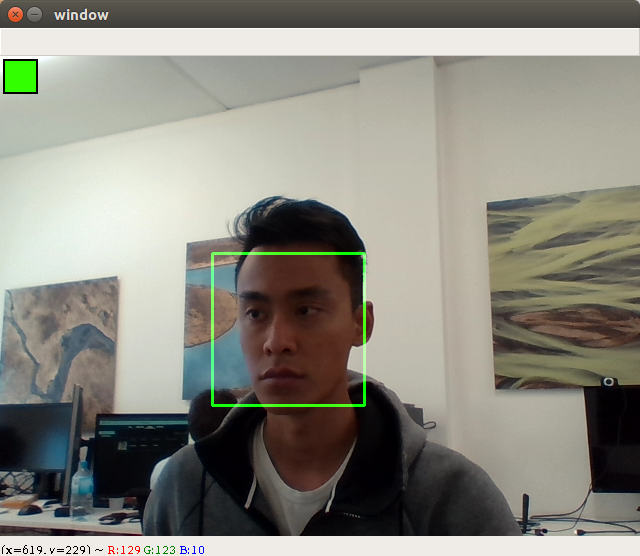
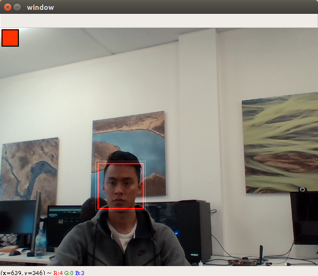

# Jetson Counter App

This counter app is a Python app designed to run on the Jetson (or any Ubuntu based OS). When on, it will read the video stream from a USB camera and detect faces in real time. If a face is detected, and it is close enough to the camera, a session will begin. When the face is no longer detected, the session will end, and a log of the session will be written to disk as a json file.

## Quick Start

If running from a development environment (e.g. Intel based Ubuntu), it should be easy to test this app. First, use a Python environment of 3.5 or greater. Then install the requirements in the root directory of this project.

```bash
pip install -r requirements.txt
```

Then to run the app with visualization, simply use the command:

```bash
python cmd_run_counter.py -v
```

The app will automatically download the Tensorflow model required for face detection, and should run whilst showing the results in a window.

## Visualization

If visualization is enabled, the app will open a live video feed to show what it is seeing.

A green bounding box will be shown around a detected face. There is a square indicator on the top left corner of the screen showing the status of the app.

**Green**: Session is active.
**Red**: Session is inactive.
**Yellow**: A face is detected, but not long enough for a session to start yet.



If a face is detected, but it is too far away from the camera (i.e. the bounding size is too small) it will be highlighted in red. A thin, white box around the red will show the size that the face needs to be for the detection to be big enough.



## Output

After each session ends, the app will generate a data file (json format) with that session's information. It will be saved to the output folder, with an increasing session index. The session index is actually persisted on the disk in a file called `session_id.txt`. It is meant to always be incrementing.

Here is a sample of what the session data file will look like.

```json
{
  "timestamp_start": 1537249876.6961884,
  "duration_in_seconds": 5.573455572128296,
  "max_faces": 1,
  "date": "18/9/2018",
  "timestamp_end": 1537249882.269644,
  "session_id": 32,
  "readable_time_end": "13:51"
}
```

It contains keys and values about when the session was started (UNIX timestamp), the duration, the maximum number of faces that was seen simultaneously during the session, the date, and the session id.

***No faces, images, or personal information will be persisted or used in any way, shape, or form.***

## Settings

The settings for the app can be configured in the `settings.yaml` file.

| Setting Name           | Description                                                  | Default Value |
| ---------------------- | ------------------------------------------------------------ | ------------- |
| MIN_FACE_SIZE          | This is the minimum size (in pixels) for a detected face to be considered as a valid detection for a session. | 100           |
| SESSION_TIMEOUT_SEC    | If no valid faces are detected for this duration (in seconds), the currently active session will end. | 1             |
| SESSION_ACTIVATION_SEC | If a session has just begun, it must remain active for this many seconds before it is considered a 'real' session. This is to prevent short, accidental sessions. | 2             |
| ROLLING_WINDOW_SIZE    | This is how many session records we will persist on disk, before deleting them. If the number of files exceed this amount, we will delete the oldest (earliest) sessions first. | 10000         |

## Requirements

I've kept the dependencies to a minimum, and I'm especially mindful that Jetson runs on ARM architecture, which makes it difficult to install a lot of the packages that Intel users take for granted. These are largely python requirements.

Jetson should come with a default image for cuda, cudnn and python. OpenCV, Tensorflow will need to be compiled and installed. I think the rest will have ARM packages available on pip.

| System Package | Version |
| -------------- | ------- |
| cuda           | 9.0     |
| cudnn          | 7.0     |
| python         | 3.5     |

| Python Package | Version |
| -------------- | ------- |
| tensorflow-gpu | 1.10.1  |
| numpy          | 1.14.5  |
| opencv-python  | 3.4.3   |
| pyyaml         | 3.13    |

## Jetson Setup Instructions

#### JetPack Installation and Reflash Jetson

1. Download [JatPack3.3](https://developer.nvidia.com/embedded/downloads#?search=jetpack%203.3) on a Linux computer
2. Follow Nvida [documentation](https://docs.nvidia.com/jetpack-l4t/index.html#jetpack/4.0ea/install.htm%3FTocPath%3D_____3) to install JetPack on Ubuntu (16.04 or 18.04)
3. Click *Next* and *Accept* all the licenses until the step 10 in the [documentation](https://docs.nvidia.com/jetpack-l4t/index.html#jetpack/4.0ea/install.htm%3FTocPath%3D_____3)
4. Choose *Device accesses Internet via router/switch* in the setp 10
5. Before clicking *Next*, you need to:
   - use two Ethnet cables to link: the computer and the router, the Jetson and the router
   - use USB cable to link Jetson and the computer
   - make sure the Jetson is powered
6. Continue clicking *Next* until *Installation Complete*
7. During Installation, if the warinings about time occurs, please use ssh to change the time on Jetson. Use the command `sudo date --set="2018-09-16 00:00:00"`


#### Install Tensorflow on Jetson

1. Download [Nvidia official prebuilt wheel file](https://nvidia.app.box.com/v/TF1101-Py35-wTRT) of Tensorflow
2. Install pip3 through `sudo apt-get install python3-pip`
3. Install Tensorflow through `pip3 install tensorflow-1.10.1-cp35-cp35m-linux_aarch64.whl`

#### Build OpenCV on Jetson

1. Run the build file `buildOpenCV.sh`
2. After the first step, you can install the new build through `sudo make install`

#### OpenCV Tests

- Run `python3 OpenCV_test/webcam_test.py ` to test using web camera on Jetson
- Run `python3 OpenCV_test/Jetsoncam_test.py` to test using Jetson onboard camera

#### Using Jetson Image
1. Follow JetPack Installation to install JetPack3.3 on the host PC
2. Use `flash.sh` to replace the `flash.sh` file in `/64_TX2/Linux_for_Tegra` folder
3. Cd into the directory containing the L4T installation package on the host PC
4. Copy `system.img` into `/64_TX2/Linux_for_Tegra/bootloader`
5. `sudo bash flash.sh -r -k APP jetson-tx2 mmcblk0p1` 